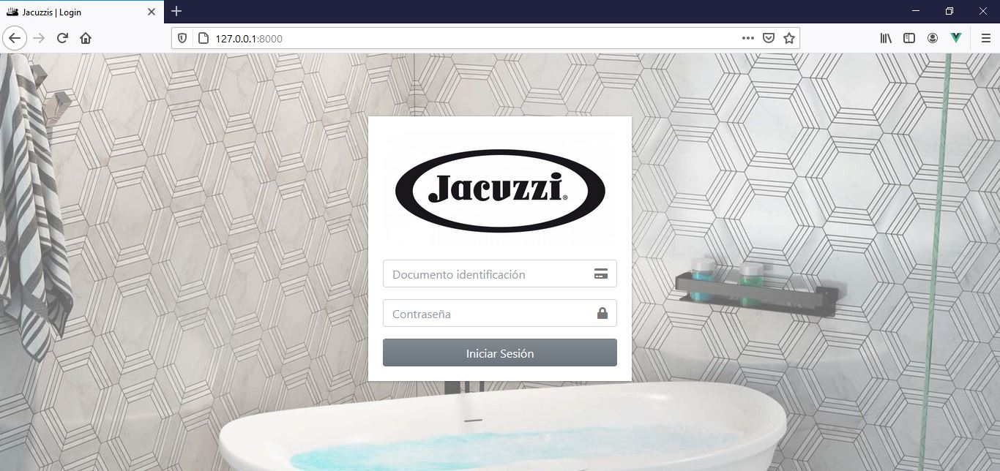
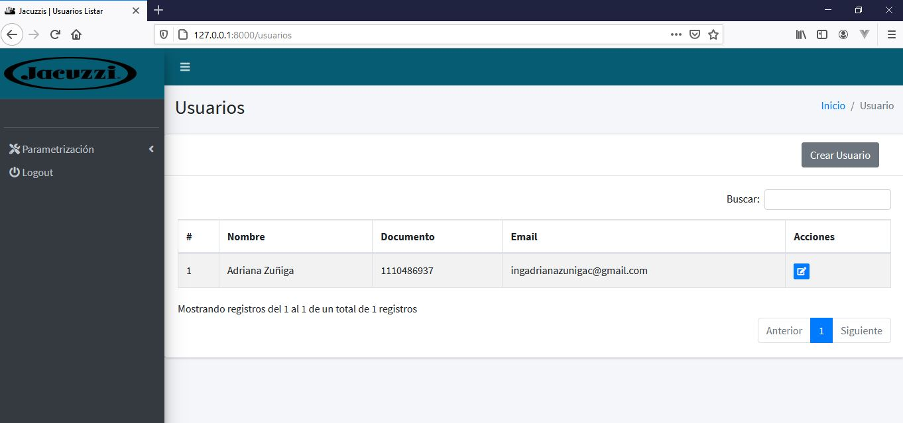

# API JACUZZI.com

La empresa Jacuzzis.com quiere llevar a cabo campaña en el cual sus clientes potenciales se
registrarán e iniciarán sesión en una app, para posteriormente participar en una encuesta y así en
un futuro participar por premios descuentos.

De acuerdo a esto se requiere:

Prueba 1. API REST

1.1. Desarrollar una API Rest en Laravel que incluya las migraciones para las tablas necesarias para
dicho proyecto
1.2. Desarrollar los endpoints para autenticación y recuperación de contraseña usando Laravel
Passport (Inicio de sesión mediante documento y clave)
1.3. Desarrollar los endpoints para la consulta de preguntas, opciones de respuesta y registro de
respuestas
1.4. Documentar dichos servicios en Postman

Prueba 2. Laravel – Blade (Monolito)

2.1 Desarrolle un sitio web en Laravel en el cual puedan iniciar sesión los usuarios del ejemplo
anterior
2.2 Desarrolle la matriz CRUD para el listado de usuarios (se puede subir una foto de los usuarios)

### Pre-requisitos 📋

PHP> = 7.3
Laravel 8.12.3

### Pasos para implementacion proyecto 📋

1. Ejecutar comando "git clone https://github.com/adrianazunigac/Jacuzzis.git"
2. Renombrar archivo .env.example a .env
3. Crear base de datos "jacuzzi"
4. Ejecutar archivo jacuzzis/alistamiento.sh , este se encargará de instalar el composer y ejecutar las migraciones y correr el programa.
5. Ingresar a http://127.0.0.1:8000 , credenciales = documento: 1110486937 y contraseña 123456789

### Monolito ⌨️

